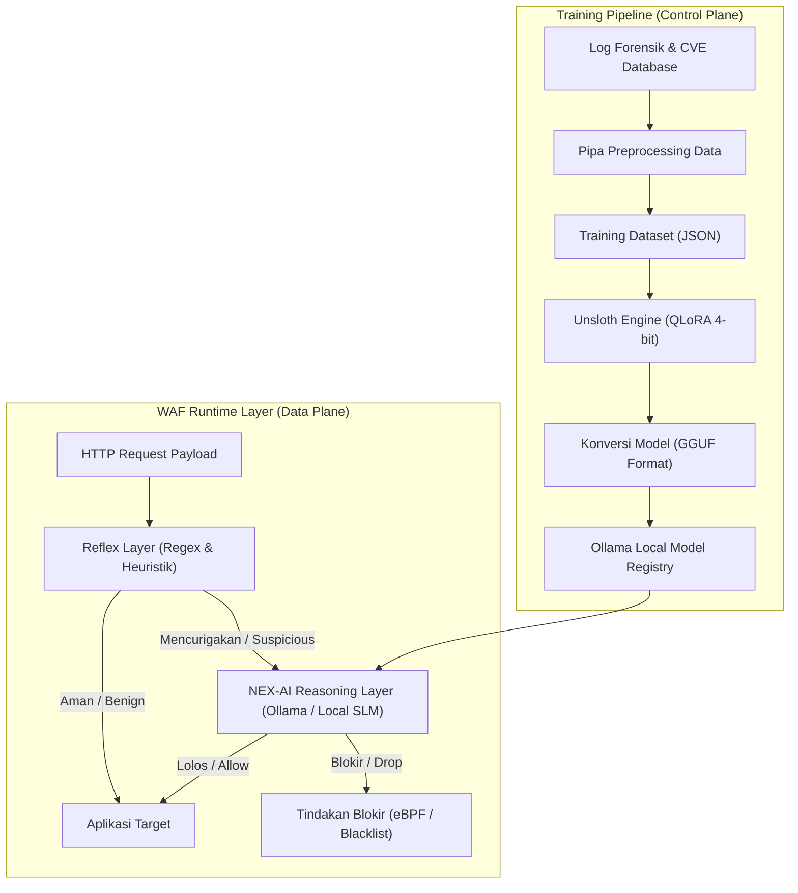

# DESAIN ARSITEKTUR TEKNIS: NEX-AI
## SISTEM KLASIFIKASI ANCAMAN LOKAL BERBASIS SMALL LANGUAGE MODEL (SLM)

Dokumen ini menjelaskan rancangan arsitektur, pipa data (data pipeline), alur inferensi, dan spesifikasi pemodelan untuk NEX-AI. Sistem ini dirancang untuk menggantikan dependensi API eksternal dengan menjalankan model bahasa kecil yang dioptimalkan secara lokal pada mesin WAF Gateway.

---

## 1. Topologi Arsitektur Sistem

NEX-AI beroperasi sebagai mesin klasifikasi terdistribusi yang terbagi menjadi dua sub-sistem utama: **Pipa Inferensi Real-time** (WAF Runtime) dan **Pipa Pelatihan Model** (Training Pipeline).



---

## 2. Pipa Pengolahan Data (Data Pipeline)

Sebelum teks payload HTTP dikirim ke model NEX-AI, data harus melalui pipa pembersihan (*sanitization*) dan penataan untuk menghindari *prompt injection* terhadap model itu sendiri.

### 2.1 Alur Preprocessing Payload
1.  **Dekode Karakter**: Mengubah seluruh encoding karakter (URL encoding, Base64, Hexadecimal) menjadi representasi teks ASCII mentah.
2.  **Trimming & Pemotongan**: Memotong payload yang masuk maksimal **1.024 token** untuk menghindari degradasi performa VRAM pada GPU lokal.
3.  **Strukturisasi JSON**: Mengubah payload mentah menjadi format JSON terstruktur yang berisi informasi:
    - `method`: Metode HTTP (GET/POST/PUT/DELETE).
    - `path`: Jalur URL request.
    - `headers`: Header HTTP sensitif (User-Agent, Content-Type, dll.).
    - `body`: Body request mentah.

---

## 3. Spesifikasi Pemodelan & Fine-Tuning

NEX-AI menggunakan model dasar **Qwen2.5-3B-Instruct** karena memiliki keseimbangan terbaik antara ukuran parameter, efisiensi VRAM, dan pemahaman sintaksis pemrograman (SQL, HTML, PHP).

### 3.1 Parameter Fine-Tuning QLoRA
Pelatihan ulang dilakukan menggunakan metode QLoRA (Quantized Low-Rank Adaptation) dengan konfigurasi hyperparameter berikut:

| Hyperparameter | Nilai Konfigurasi | Keterangan |
| :--- | :--- | :--- |
| **Model Dasar** | Qwen2.5-3B-Instruct | Model Small Language Model (SLM) dasar |
| **Quantization** | 4-bit NormalFloat (NF4) | Mereduksi kebutuhan VRAM saat pelatihan |
| **LoRA Rank (r)** | 16 | Kapasitas adaptasi parameter |
| **LoRA Alpha** | 32 | Faktor skala bobot LoRA |
| **Target Modules** | q_proj, k_proj, v_proj, o_proj | Modul perhatian (attention layers) yang dilatih |
| **Learning Rate** | 2e-4 | Kecepatan penyesuaian bobot |
| **Batch Size** | 2 | Ukuran tumpukan per langkah |
| **Gradient Accumulation** | 4 | Akumulasi gradien sebelum pembaruan |
| **Optimizer** | AdamW 8-bit | Pengoptimal hemat memori |

### 3.2 Struktur Prompt Sistem (System Prompt)
Model dimuat di Ollama menggunakan parameter sistem yang ketat untuk mengunci keluaran agar selalu berformat JSON valid:

```text
System: Anda adalah mesin klasifikasi ancaman keamanan siber real-time. Tugas Anda adalah menganalisis payload request HTTP dan memberikan keputusan klasifikasi dalam format JSON tanpa ada penjelasan teks tambahan.

Respons harus mengikuti skema berikut:
{
  "status": "BENIGN" | "SUSPICIOUS" | "MALICIOUS",
  "threat_score": 0.00 hingga 1.00,
  "attack_type": "SQL_INJECTION" | "CROSS_SITE_SCRIPTING" | "PATH_TRAVERSAL" | "COMMAND_INJECTION" | "NONE",
  "reason": "Alasan singkat analisis kerentanan"
}
```

---

## 4. Alur Inferensi Lokal & Mekanisme Kegagalan (Fail-Safe)

Untuk menjaga agar WAF Gateway tidak mengalami *deadlock* jika server inferensi lokal (Ollama) mengalami overload CPU/GPU, dirancang mekanisme perlindungan sebagai berikut:

```
[ HTTP Request ]
       │
       ▼
[ AI Reflex Filter (Regex) ] ── (Mencurigakan) ──► [ AI Reasoning (Ollama) ]
       │                                                    │
       │ (Aman)                                         (Overload / Timeout > 200ms)
       │                                                    │
       ▼                                                    ▼
[ Meneruskan ke Backend ] ◄──────────────────────── [ Fallback Mode (Regex Active) ]
```

1.  **Timeout Inferensi**: Batas waktu maksimal pemanggilan API Ollama lokal dibatasi sebesar **200ms**. Jika inferensi tidak selesai dalam batas waktu tersebut, sistem secara otomatis masuk ke **Fallback Mode**.
2.  **Fallback Mode (Fail-Open/Fail-Secure)**: Gateway akan mengabaikan keputusan AI dan langsung beralih kembali ke penyaringan berbasis filter Regex lokal untuk memastikan tidak ada penurunan performa pada sisi pengguna akhir.
3.  **Cache Hasil Analisis**: Setiap payload yang telah dianalisis oleh NEX-AI akan disimpan di cache Redis selama 1 jam. Request yang memiliki payload identik tidak akan dikirim kembali ke AI, melainkan langsung menggunakan hasil klasifikasi dari cache.
