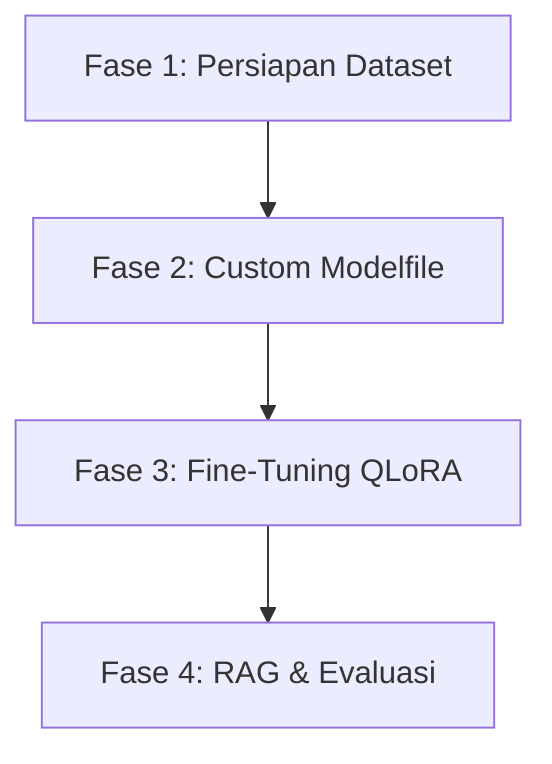

# 🗺️ ROADMAP PELATIHAN MODEL AI LOKAL (NEX-AI)
Peta Jalan Kustomisasi dan Fine-Tuning Model LLM Lokal untuk WAF Gateway & Analisis Forensik

---

## 🎯 Visi & Misi NEX-AI
Mengeliminasi ketergantungan pada API komersial eksternal (Groq, OpenRouter, x.ai) dengan melatih model bahasa kecil secara lokal (**Small Language Models - SLM**) agar memiliki kecerdasan setara analis keamanan siber senior, beroperasi 100% offline, hemat konsumsi daya, dan berlatensi ultra-rendah (<50ms).

---

## 📅 Rencana Eksekusi Tahapan (4 Fase)



### 📁 Fase 1: Persiapan & Pelabelan Dataset (Dataset Preparation)
Sebelum melatih model, kita membutuhkan dataset latih yang merepresentasikan ancaman dunia nyata:
1.  **Pengumpulan Log Lintas Data**:
    *   Mengumpulkan log normal (*Benign Traffic*) dari lintas data dasbor.
    *   Mengumpulkan payload serangan (*Malicious Traffic*) dari database CVE publik, repositor OWASP Top 10, dan repositori payload SQLi/XSS umum.
2.  **Format Pelabelan JSON (Instruksi Chat)**:
    Ubah dataset menjadi format JSON standar instruksi chat:
    ```json
    [
      {
        "instruction": "Classify this traffic metadata as BENIGN, SUSPICIOUS, or MALICIOUS.",
        "input": "{\"source_ip\":\"192.168.1.100\",\"method\":\"POST\",\"request_pattern\":\"SELECT * FROM users WHERE id = 1 UNION SELECT username, password FROM admin\"}",
        "output": "{\"classification\":\"MALICIOUS\",\"confidence\":0.99,\"threat_type\":\"SQL_INJECTION\"}"
      }
    ]
    ```
3.  **Jumlah Data**: Minimal 2.000 baris sampel (1.000 aman, 1.000 serangan) untuk hasil optimal.

---

### 🕹️ Fase 2: Kustomisasi Modelfile Ollama (Few-Shot Prompting)
Langkah instan tanpa melatih ulang bobot model dasar untuk mereduksi tingkat kegagalan format (*parsing error*):
1.  **Membuat `Modelfile`**:
    Buat file konfigurasi bernama `Modelfile` di dalam direktori `NEX-AI/`:
    ```dockerfile
    FROM qwen2.5:3b
    PARAMETER temperature 0.0
    PARAMETER top_p 0.9
    SYSTEM "You are a real-time network threat classifier. Respond ONLY with valid JSON."
    MESSAGE user "{\"request_pattern\":\"GET /api/users\"}"
    MESSAGE assistant "{\"classification\":\"BENIGN\",\"confidence\":0.99,\"threat_type\":null}"
    ```
2.  **Kompilasi Model**:
    Jalankan kompilasi di terminal lokal:
    ```bash
    ollama create nex-waf-reflex:3b -f ./Modelfile
    ```

---

### 🧠 Fase 3: Pelatihan Ulang Parameter (Fine-Tuning QLoRA)
Melakukan pelatihan ulang menggunakan GPU lokal/cloud untuk menyematkan insting siber langsung ke dalam neuron model:
1.  **Teknologi Pelatihan**:
    *   **Unsloth**: Library Python tercepat untuk melatih LLM lokal (lebih hemat memori hingga 80% dan 2x lebih cepat).
    *   **QLoRA (4-bit quantization)**: Memungkinkan kita melatih model 3B atau 7B pada satu kartu GPU kelas konsumen (misal VRAM 12GB/16GB).
2.  **Hardware yang Dibutuhkan**:
    *   GPU Nvidia RTX 3060/4060 (minimum) atau RTX 3090/4090 (sangat disarankan).
    *   RAM sistem minimal 16GB.
3.  **Konversi & Ekspor**:
    Setelah selesai dilatih, ekspor model menjadi format `.GGUF` agar bisa dimuat langsung oleh Ollama.

---

### 🛡️ Fase 4: Integrasi Basis Pengetahuan (RAG & Evaluasi)
Menghubungkan model penalaran (*Reasoning Layer*) dengan database pengetahuan CVE offline:
1.  **Vector Database Lokal**: Menggunakan SQLite dengan ekstensi vss atau ChromaDB lokal.
2.  **Logika Evaluasi**:
    *   Jika model memblokir IP, model Reasoning akan mencocokkan payload serangan dengan modul CVE di Vector DB untuk mengonfirmasi apakah ada anomali Zero-Day yang riil.
    *   Menghindari *False Positive* pada traffic user normal.

---

## 🛠️ Panduan Perangkat Keras Pelatihan (Hardware Guide)

| Ukuran Model | RAM Minimum | VRAM GPU (Latihan) | Kecepatan Inferensi (CPU) |
| :--- | :--- | :--- | :--- |
| **Qwen2.5:0.5B** | 4 GB | 4 GB (RTX 3050) | Sangat Cepat (~35 tokens/s) |
| **Qwen2.5:3B** | 8 GB | 12 GB (RTX 3060) | Cepat (~15 tokens/s) |
| **Qwen2.5:7B** | 16 GB | 16 GB (RTX 4060 Ti) | Sedang (~6 tokens/s) |
