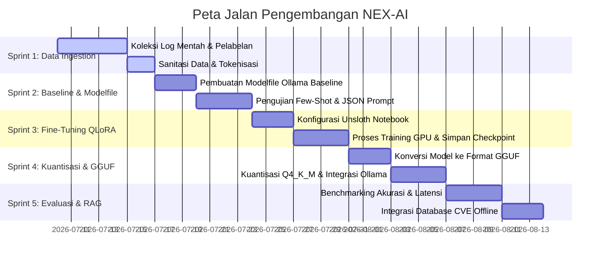

# PETA JALAN PENGEMBANGAN MODEL AI LOKAL: NEX-AI
## RENCANA PELAKSANAAN SPRINT PELATIHAN DAN INTEGRASI MODEL CYBER-SECURITY

Dokumen ini berisi peta jalan pengembangan terperinci untuk melatih, mengevaluasi, melakukan kuantisasi, dan menerapkan model bahasa kecil (Small Language Model - SLM) secara lokal sebagai mesin analisis ancaman siber pada WAF Gateway Nexus Cyber.

---

## 1. Pembagian Kerja Berdasarkan Sprint

Pengembangan model NEX-AI dibagi menjadi 5 Sprint dengan target output yang terukur:



---

## 2. Rincian Kegiatan per Sprint

### Sprint 1: Pengumpulan & Pelabelan Dataset (7 Hari)
*   **Tujuan**: Menghasilkan 5.000 baris sampel instruksi keamanan siber berkualitas tinggi.
*   **Tugas**:
    1.  Mengekstrak log lalu lintas normal dari database WAF Gateway.
    2.  Mengunduh contoh serangan SQLi, XSS, Path Traversal, dan Command Injection dari dataset publik seperti OWASP Benchmark dan SecLists.
    3.  Melabeli dataset ke dalam format instruksi terstruktur:
        ```json
        {
          "instruction": "Lakukan klasifikasi payload HTTP ini. Tentukan status (BENIGN, SUSPICIOUS, MALICIOUS), tipe serangan (SQL_INJECTION, XSS, DLL), dan threat score.",
          "input": "POST /login HTTP/1.1\nHost: target.com\n\nusername=admin' OR '1'='1",
          "output": "{\"status\": \"MALICIOUS\", \"threat_score\": 0.98, \"attack_type\": \"SQL_INJECTION\", \"reason\": \"Mendeteksi bypass autentikasi menggunakan tautologi OR 1=1\"}"
        }
        ```

### Sprint 2: Pembuatan Model Baseline & Few-Shot Prompting (7 Hari)
*   **Tujuan**: Membuat prototipe model awal menggunakan taktik few-shot prompting tanpa pelatihan ulang.
*   **Tugas**:
    1.  Mengunduh model dasar `qwen2.5:3b-instruct` menggunakan Ollama.
    2.  Menyusun struktur Modelfile di `NEX-AI/Modelfile` dengan menyertakan 5 pasang contoh request-response (few-shot) sebagai acuan model.
    3.  Membangun model lokal dengan perintah:
        ```bash
        ollama create nex-ai-baseline -f ./Modelfile
        ```
    4.  Menguji stabilitas keluaran JSON model baseline menggunakan skrip pemindaian otomatis untuk memastikan format JSON tidak rusak saat memproses input yang tidak biasa.

### Sprint 3: Proses Pelatihan Model / Fine-Tuning QLoRA (7 Hari)
*   **Tujuan**: Melatih model dasar menggunakan pustaka Unsloth pada GPU untuk meningkatkan kecerdasan keamanan siber hingga akurasi >95%.
*   **Tugas**:
    1.  Mempersiapkan lingkungan notebook Jupyter menggunakan Docker image CUDA resmi.
    2.  Menjalankan pemuatan model dalam format presisi rendah 4-bit NF4 guna menghemat konsumsi memori GPU (VRAM).
    3.  Mengonfigurasi parameter LoRA dengan peringkat (rank) 16 dan LoRA Alpha 32.
    4.  Melakukan pelatihan sebanyak 3 epoch dengan learning rate 2e-4.
    5.  Menyimpan bobot model akhir (*adapters*) ke dalam format biner PyTorch/Safetensors.

### Sprint 4: Konversi, Kuantisasi, dan Registrasi Ollama (7 Hari)
*   **Tujuan**: Mengonversi hasil latihan menjadi format yang didukung oleh mesin inferensi lokal Ollama dengan performa optimal.
*   **Tugas**:
    1.  Menggabungkan bobot LoRA dengan model dasar Qwen menggunakan skrip ekspor dari Unsloth.
    2.  Mengunduh perangkat perangkat lunak `llama.cpp` untuk melakukan konversi model ke tipe `.GGUF` presisi FP16.
    3.  Melakukan kuantisasi model ke tipe `Q4_K_M` (4-bit quantization) untuk mereduksi ukuran file model hingga ~1.9 GB tanpa mengalami penurunan akurasi yang signifikan.
    4.  Mendaftarkan model final ke registry Ollama lokal:
        ```bash
        ollama create nex-ai-protect -f ./Modelfile.production
        ```

### Sprint 5: Benchmarking, Evaluasi, dan Integrasi RAG (7 Hari)
*   **Tujuan**: Memastikan kecepatan inferensi memenuhi syarat latensi WAF dan mengintegrasikan basis pengetahuan eksternal.
*   **Tugas**:
    1.  Menguji performa model menggunakan 500 payload baru yang belum pernah dilihat saat pelatihan (*test split*).
    2.  Mengukur metrik efektivitas klasifikasi:
        - **Precision**: Akurasi deteksi ancaman riil (Target: >97%).
        - **Recall**: Kemampuan menyaring seluruh ancaman yang masuk (Target: >95%).
        - **Latency**: Waktu pemrosesan per request (Target: <100ms pada GPU lokal).
    3.  Membangun database vektor lokal berbasis SQLite-VSS yang berisi pustaka data kerentanan CVE terbaru.
    4.  Menghubungkan model dengan database CVE tersebut menggunakan pola RAG (Retrieval-Augmented Generation) untuk memberikan alasan analisis yang lebih mendalam pada laporan dasbor SOC.

---

## 3. Metrik Evaluasi Kesiapan Produksi (Production Readiness Criteria)

Model hanya diperbolehkan dirilis ke WAF Gateway utama apabila telah lolos kriteria batas minimum di bawah ini:

| Kategori Evaluasi | Metode Pengujian | Batas Minimum Kelulusan |
| :--- | :--- | :--- |
| **Akurasi Deteksi** | Diuji terhadap 500 sampel OWASP Benchmark | F1-Score minimal 0.95 |
| **Toleransi Kesalahan** | Pengujian input kosong, sangat panjang, atau acak | JSON parser error rate 0% |
| **Kecepatan Inferensi** | Diukur pada kartu grafis RTX 3060 Laptop (VRAM 6GB) | Waktu respon rata-rata <80ms |
| **Stabilitas Memori** | Menjalankan pengujian stress-test selama 24 jam | Kebocoran memori (leak) 0 MB |
