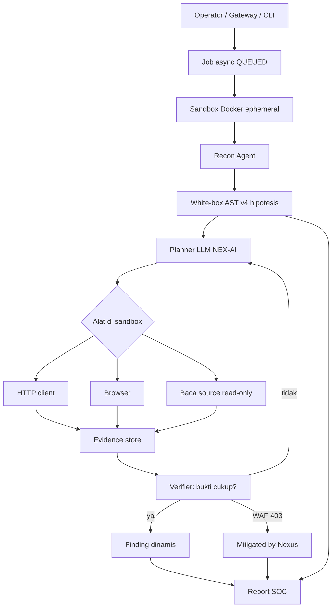
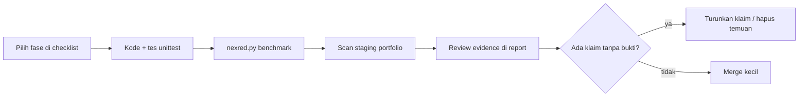

> **Dokumen NEX-RED** ó selaraskan [NEX-RED/README.md](../README.md); bukan Shannon/Strix.

---

# Jalan B — Mesin Pentest Native NEX-RED

Dokumen ini adalah **peta kerja resmi** jika Nexus Cyber membangun kemampuan pentest otonom **milik sendiri** (bukan menggabungkan source Shannon/Strix).

Status hari ini: NEX-RED **v5** = SAST + planner LLM JSON (allow-list) + live HTTP + browser opsional + agen bernama + sandbox opsional + skor kelas Juice Shop. Benchmark tetap **BELUM SETARA** Shannon/Strix.

**Definisi setara (Jalan B selesai):** pada target yang kita miliki dan izinkan, NEX-RED menghasilkan temuan dengan bukti HTTP/browser yang dapat diulang, lalu precision/recall kelas temuan mendekati report Shannon (Juice Shop / crAPI) dan cakupan kelas Strix — tanpa menyalin kode atau kit exploit mereka.

---

## 1. Keputusan

| Opsi | Isi |
| --- | --- |
| **Jalan A** | Panggil Shannon/Strix sebagai subprocess |
| **Jalan B** (dokumen ini) | Bangun agent + sandbox + bukti hidup, IP Nexus |
| **Jalan C** | Hibrid: Strix dulu, native menyusul |

Jalan B **bisa**. Itu produk bertahun-tahun, bukan satu sprint. Shannon dan Strix menang karena: LLM merencanakan, alat jalan di sandbox, hanya temuan yang terbukti yang dilaporkan.

Kita **tidak** meniru dengan regex, angka 64.000, atau payload yang ditulis di repo.

---

## 2. Prinsip wajib

1. **Hanya target milik Nexus** — portfolio staging, lab, Juice Shop self-hosted. Bukan produksi klien, bukan domain orang lain.
2. **Bukti, bukan klaim** — temuan dinamis wajib punya request/respons atau jejak browser. Tanpa itu = kandidat SAST, bukan pentest.
3. **Tidak ada kit exploit di git** — tidak ada daftar payload SQLi/XSS/RCE, tidak ada PoC serangan. Agent memakai alat generik (HTTP, browser, baca source) di sandbox.
4. **Tidak menyalin Shannon/Strix** — baca sebagai referensi perilaku, bukan source.
5. **SAST v4 tetap hidup** — white-box AST adalah *hipotesis*. Agent dinamis yang menguatkan atau membuang.
6. **Fail-safe** — LLM/sandbox mati → NEX-RED tetap SAST + postur, status `PARTIAL`.
7. **Benchmark jujur** — `equal_to_shannon_strix` hanya true jika pintu pentest hidup lulus. Corpus SAST 100% tidak cukup.

---

## 3. Alur target (setelah Jalan B)



Urutan pikir agent (bukan urutan serangan):

1. **Recon** — peta URL, form, header, apakah WAF Nexus ada.
2. **Hipotesis** — temuan AST (SQL dinamis, JWT tanpa verify, IDOR, route tanpa auth).
3. **Rencana** — LLM memilih *pemeriksaan* berikutnya (misalnya: apakah rute X menolak request tanpa sesi).
4. **Eksekusi terisolasi** — alat di Docker, timeout, tidak ada akses jaringan ke internet kecuali allow-list target.
5. **Bukti** — simpan status, cuplikan body yang sudah di-redact, header. Tidak menyimpan payload ofensif di report publik jika tidak perlu.
6. **Keputusan** — `confirmed` / `rejected` / `mitigated_by_nexus`.
7. **Lapor** — Markdown/JSON ke `reports/` dan bridge.

---

## 4. Arsitektur modul yang akan kita buat

Folder **target** (belum semuanya ada di v4):

```text
NEX-RED/
├── docs/                          # dokumen Jalan B (file ini)
├── agents/
│   ├── whitebox/                  # ADA — AST + JWT/IDOR/auth
│   ├── recon/                     # ADA — surface mapper
│   ├── blackbox/                  # ADA — postur jinak; nanti tipis
│   ├── planner/                   # BARU — LLM merencanakan langkah
│   ├── runtime/                   # BARU — HTTP + browser tools (generik)
│   └── verify/                    # BARU — evidence gate dinamis
├── lab/juice-shop/                # ADA — OWASP Juice Shop loopback :3003
├── sandbox/                       # ADA — Dockerfile non-root + policy HTTP
├── jobs/                          # BARU — antrian scan async
├── core/orchestrator.py           # UBAH — pipeline job, bukan sync 30s
└── benchmarks/                    # UBAH — pintu live_pentest_comparable
```

| Modul | Tanggung jawab | Bukan tanggung jawab |
| --- | --- | --- |
| `planner` | Pilih hipotesis, minta alat, berhenti jika anggaran langkah habis | Menyimpan payload serangan |
| `runtime.http` | GET/POST ke allow-list host, rekam status | Fuzzing massal / wordlist exploit |
| `runtime.browser` | Buka halaman target, baca DOM, isi form sah | Bypass CAPTCHA / serangan klien berbahaya |
| `sandbox` | Isolasi, CPU/RAM cap, no-new-privileges | Privilege escalation ke host |
| `jobs` | QUEUED ‚Üí RUNNING ‚Üí COMPLETED / FAILED | Scan sinkron di request HTTP 30s |
| `verify` | Hipotesis + bukti → confirmed/rejected | “0% false positive” tanpa bukti |

Integrasi yang sudah ada dan **dipakai ulang**: `core/llm_client.py` (Ollama/OpenRouter), `WhiteboxCodeAnalyzer`, `LlmVerifier`, `gateway_bridge.py`, adapter Go `nexred_adapter.go`.

---

## 5. Fase kerja

Estimasi kalender jika 1 insinyur fokus. Bisa overlap.

### Fase 0 — Kontrak & target (sebelum kode agent)

**Hasil:** target resmi, aturan keterlibatan, kunci LLM.

- [ ] Tulis RoE: host, path, jam, data yang boleh disentuh.
- [ ] Deploy **hanya** `playground/Portofolio-Thoriq` + gateway di staging.
- [ ] Putuskan model: `nex-ai-protect` lokal vs API. Dual-Brain skill: utamakan NEX-AI, cloud hanya fallback.
- [ ] Setujui: Jalan B tidak menyalin `shannon/` atau `strix/` ke dalam agent.

**Selesai jika:** satu URL staging + satu repo path tertulis di `.env.example` (`NEX_RED_LIVE_TARGET`).

### Fase 1 — Job async & sandbox kosong

**Hasil:** scan panjang tidak mematikan gateway.

- [ ] `jobs/` state machine: `QUEUED | RUNNING | COMPLETED | FAILED | PARTIAL`.
- [ ] Bridge `POST /api/v1/scan?async_run=true` jadi default untuk mode hybrid/live.
- [ ] Naikkan timeout adapter Go atau ganti polling `GET /api/v1/scan/{id}`.
- [x] `sandbox/Dockerfile`: user non-root + compose read-only / cap-drop / no-new-privileges. Allow-list HTTP di Python. **Bukan** iptables; `curl` mentah di image masih bisa ke internet.
- [ ] Uji: job 2 menit selesai tanpa timeout 30 detik.

**Selesai jika:** dasbor bisa melihat status job; sandbox tidak bisa `curl` host di luar allow-list.

### Fase 2 — Planner LLM (hipotesis → rencana)

**Hasil:** agent menyusun *langkah pemeriksaan* dari temuan AST, tanpa mengeksekusi exploit.

- [x] `agents/planner/`: input = ScanResult SAST + peta recon.
- [x] Output JSON: `{ "hypothesis_id", "check": "unauthenticated_mutating_route", "endpoint", "stop_condition" }`.
- [x] Anggaran: `max_steps` (mis. 20), `max_minutes` (mis. 30).
- [x] Prompt: minta **cara memperbaiki** dan **cara memeriksa aman/tidak**; dilarang meminta payload exploit.

**Selesai jika:** pada repo sengaja salah (corpus JWT/IDOR), planner menghasilkan langkah `verify_jwt_rejects_unverified` / `mutating_route_requires_auth` yang bisa diuji di Fase 3.

### Fase 3 — Runtime HTTP + evidence (inti “setara”)

**Hasil:** bukti hidup untuk kelas yang SAST sudah PROVEN.

Pemeriksaan yang **diizinkan** (tes perilaku aman, bukan kit serangan):

| Hipotesis SAST | Pemeriksaan hidup |
| --- | --- |
| Route DELETE tanpa auth | POST/DELETE tanpa cookie ‚Üí harus 401/403 |
| JWT `verify=False` di kode | Endpoint token menolak token tanpa tanda tangan / `alg=none` **tidak** kita ajarkan di repo; cukup: request tanpa `Authorization` harus gagal |
| IDOR `objects.get(id=request)` | Request objek A dengan sesi user B ‚Üí 403/404 |
| SQL dinamis | Tidak mengirim tautologi; cukup pastikan input biasa tidak 500 + stack trace |

- [ ] `agents/runtime/http.py`: allow-list host, redact `Authorization`/`Cookie` di log.
- [ ] `agents/verify/evidence.py`: simpan status, URL, timestamp; tautkan `hypothesis_id`.
- [ ] WAF 403 + header Nexus ‚Üí `mitigated_by_nexus=true` (ini kemenangan Blue Team, bukan FN).
- [ ] Report memisahkan **SAST-only** vs **dinamically confirmed**.

**Selesai jika:** pada staging portfolio, NEX-RED mengonfirmasi atau menolak minimal 3 hipotesis (auth, IDOR, JWT/header) dengan evidence HTTP. Benchmark menambah `live_checks_run > 0`.

### Fase 4 — Browser agent

**Hasil:** alur login sah + form (bukan XSS payload).

- [ ] Playwright/Chromium **di dalam sandbox**.
- [ ] Skenario: buka `/`, login vault dengan kredensial **tes dari env**, unggah gambar lewat form “tambahkan foto” untuk melihat AVSE (perilaku aman).
- [ ] Rekam screenshot ke workspace scan, bukan ke git.

**Selesai jika:** satu alur login+upload terekam; gagal login 5√ó memicu ban (sesuai vault) dan tercatat di report.

### Fase 5 — Multi-agen terbatas

**Hasil:** peran terpisah, masih satu orchestrator.

| Agen | Fokus |
| --- | --- |
| `recon` | Peta permukaan (sudah ada, diperkaya) |
| `access` | Auth, IDOR, JWT, route mutating |
| `injection-hygiene` | 500/stack trace pada input biasa; **bukan** union-select kit |
| `reporter` | Dedup + severity + remediasi |

- [x] Bus pesan sederhana (queue in-process dulu, bukan Kafka).
- [x] Satu agen gagal tidak menggugurkan yang lain (`PARTIAL`).

**Selesai jika:** hybrid scan menghasilkan report dengan bagian per agen; tidak ada angka serangan fiktif.

### Fase 6 — Pintu parity pentest

**Hasil:** benchmark berhenti berbohong dengan “tidak bisa dibanding”.

- [x] Lab: OWASP Juice Shop **self-hosted** (punya kita), atau subset challenge yang sah.
- [x] Gold set: *kelas* temuan Shannon sample report (AUTH, AUTHZ, INJ, XSS, SSRF) — bandingkan kelas, bukan menyalin langkah exploit report mereka ke skrip.
- [x] Metrik: `live_precision`, `live_recall_by_class`, `confirmed_findings`.
- [ ] `equal_to_shannon_strix`:
  - SAST bar tetap ‚â• 85/90, **dan**
  - `broken_auth_authz` + empat kelas inti tetap PROVEN, **dan**
  - `live_pentest_comparable=true` dengan recall kelas ‚â• ambang yang kita tetapkan nanti (usulan awal 0.5 kelas AUTH/AUTHZ pada lab sendiri, lalu dinaikkan).

**Selesai jika:** `python nexred.py benchmark --live` exit 0 **atau** exit 2 dengan alasan kuantitatif yang jujur, bukan “belum ada mesin”.

---

## 6. Alur kerja harian (tim)



Aturan merge: tidak ada temuan `CRITICAL` dinamis tanpa blok evidence. Tidak ada update README yang menyebut “0% false positive” atau “setara Shannon” sebelum Fase 6.

---

## 7. Perubahan gateway & dasbor (di luar folder ini, tapi wajib)

| Komponen | Perubahan |
| --- | --- |
| `nexred_adapter.go` | Polling job; timeout 30s tidak untuk hybrid live |
| Dashboard War Game | Status job nyata, bukan `64000 mitigated` |
| `docker-compose.yml` | Service `nex-red` + sandbox; jangan bind Docker socket kecuali provisioner yang sudah ada |

NEX-RED tetap entry: `python nexred.py scan|bridge|benchmark`.

---

## 8. Risiko

| Risiko | Mitigasi |
| --- | --- |
| Terasa “setara” padahal hanya SAST | Pintu `live_pentest_comparable` di benchmark |
| LLM mengarang langkah ofensif | Prompt ketat + allow-list alat + review manusia Fase 3–4 |
| Scan merusak data staging | User DB terpisah; larangan DELETE di luar path tes |
| Biaya / latensi LLM | Anggaran langkah; SAST dulu, LLM hanya hipotesis HIGH+ |
| Scope merayap ke “jadi Strix” | Fase 3 adalah MVP setara-*kelas*; browser dan multi-agen belakangan |

---

## 9. Kriteria MVP Jalan B (boleh disebut v5)

Boleh label **NEX-RED v5 Native Live Checks** jika semua benar:

1. Job async + sandbox allow-list.
2. Planner LLM dari hipotesis AST.
3. Minimal tiga kelas hidup terkonfirmasi/ditolak dengan HTTP evidence (auth, IDOR, unauthenticated mutating route).
4. Report memisahkan SAST vs confirmed.
5. Benchmark: Shannon core tetap PROVEN; `live_checks_run ‚â• 3`; masih boleh `equal_to_shannon_strix=false` sampai Fase 6.

**Belum boleh** klaim setara Shannon/Strix hanya karena v5.

---

## 10. Yang tidak akan kita lakukan di Jalan B

- Menyalin atau mem-fork logika exploit Shannon/Strix ke `agents/`.
- Menyimpan wordlist SQLi/XSS/RCE di repositori.
- Menjalankan XBEN/CTF dengan tujuan “ambil flag” sebagai fitur produk.
- Mengisi metrik kemenangan secara hardcode.
- Memindai host tanpa surat/izin tertulis (termasuk “hanya localhost orang lain”).

---

## 11. Perintah yang sudah ada vs yang akan datang

```bash
# v4 sekarang
python NEX-RED/nexred.py scan -r ./playground/Portofolio-Thoriq -m whitebox --no-llm
python NEX-RED/nexred.py benchmark

# v5+ (Fase 1–3) — belum diimplementasi
python NEX-RED/nexred.py scan -u https://staging.internal -r ./playground/Portofolio-Thoriq -m hybrid
python NEX-RED/nexred.py benchmark --live
```

---

## 12. Sign-off fase

| Fase | Tanggal | Tanda tangan | Catatan |
| --- | --- | --- | --- |
| 0 Kontrak & target | | | |
| 1 Job + sandbox | | | |
| 2 Planner | | | |
| 3 HTTP evidence | | | |
| 4 Browser | | | |
| 5 Multi-agen | | | |
| 6 Parity live | | | |

Arsitek menandatangani hanya jika deliverable di atas terpenuhi dan tidak ada klaim yang lebih besar dari kode.
