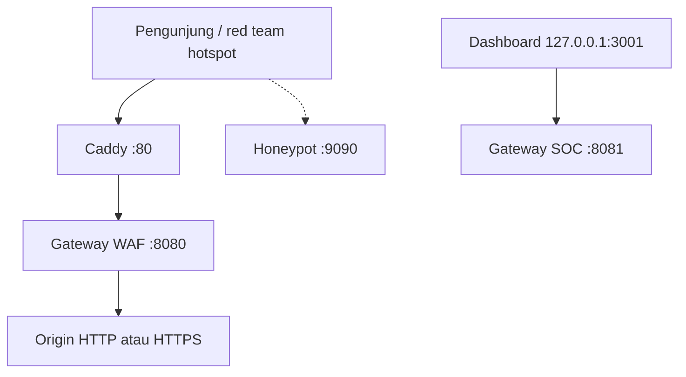

# Nexus Cyber Deployment Architecture

**Pembaruan:** 2026-08-22  
**Model produk:** [PRODUCT_MODEL.md](./PRODUCT_MODEL.md) — GaaS instance per kanal; control plane **bukan** port WAF publik.

## Zona

1. **Data plane** — pengunjung/red team: Caddy `:80`/`:443` → gateway **`:8080`** (proxy + WAF). Honeypot `:9090`.
2. **Control plane** — operator di laptop: gateway **`:8081`** dan dasbor **`127.0.0.1:3001`**. Tidak dipublish ke hotspot.



eBPF/XDP di diagram lama **bukan** jalur drop paket nyata.

### Edge Gateway
- Publik: 80/443 (Caddy), 8080 (WAF langsung, hati-hati di lab).
- Internal SOC: `127.0.0.1:8081`.
- Jangan mem-proxy semua `/api` dasbor ke `:8080`. Middleware `PublicDataPlane`: path SOC di `:8080` → **404**; mutasi/API asing tanpa `nexus_session` → **401**. Lab Gallery/vault/PoW tetap publik di data plane.
- Satu nama situs: `PROTECTED_HOST` (default lab `portfolio.nexus-lab.test`). Caddy `:443` on-demand hanya jika `HasExplicitRoute`. Hotspot tetap `http://IP`. SOC `:8081`/`:3001` tidak dipublish. Origin instance = `TARGET_BACKEND` (`START.bat` = Vercel); named-host dan loopback WAF harus sama.

### 2. Website Aplikasi Asli (Protected Backend Web Application)
* **Tanggung Jawab**: Menyajikan konten visual, portal login, dan memproses data bisnis utama klien (misalnya Portal OJK Portal).
* **Lokasi Deployment**: Di dalam kontainer Docker internal atau VM sekunder di dalam subnet privat (*private subnet*).
* **Persyaratan Keamanan**: **Dilarang keras mengekspos port aplikasi ini ke internet publik**. Satu-satunya entitas yang boleh terhubung ke port aplikasi ini (misal port 3001) adalah VM tempat Go Gateway berjalan.

### 3. Database Persistent & Real-Time Cache (PostgreSQL & Redis)
* **Tanggung Jawab**: 
  * **Redis**: Menyimpan state MTD, *distributed token bucket rate limiter*, serta sinkronisasi daftar IP Blacklist berkecepatan tinggi.
  * **PostgreSQL**: Menyimpan log audit ISO 27001 permanen, riwayat perputaran port MTD (*audit trail*), serta insight analitis AI.
* **Lokasi Deployment**: Server database terkelola (Managed Database Service) atau VM database terdedikasi di dalam *private subnet*.

---

## 🔒 Panduan Akses Dashboard SOC Command Center

Dasbor Administrasi (**Next.js Dashboard**) tidak boleh dipublikasikan secara bebas di internet. Jika dasbor ini bocor ke publik, peretas dapat mencoba mematikan proteksi siber secara paksa. 

Berikut adalah 3 metode standar industri untuk mengakses dasbor secara aman:

### Metode A: Akses Melalui Virtual Private Network (VPN) - Rekomendasi Utama
1. Dideploy secara lokal pada server internal di dalam VPC.
2. Analis SOC wajib mengaktifkan koneksi VPN kantor (seperti **WireGuard**, **OpenVPN**, atau **Tailscale**).
3. Setelah terowongan enkripsi VPN aktif, analis mengakses dasbor melalui IP privat atau nama domain lokal:
   ```
   http://10.100.20.10:3001 atau http://soc.nexus-cyber.internal
   ```

### Metode B: Secure Shell (SSH) Port Forwarding
1. Dasbor Next.js dikonfigurasi untuk hanya menerima koneksi dari mesin lokal server itu sendiri (`localhost` / `127.0.0.1`).
2. Analis SOC melakukan port-forwarding aman dari laptop mereka melalui SSH:
   ```bash
   ssh -L 3001:localhost:3001 -L 8081:localhost:8081 user@ip-server-soc.company.com -N
```
3. Analis membuka `http://localhost:3001` (UI) yang memanggil API `http://127.0.0.1:8081`.

### Metode C: Strict Firewall IP Whitelisting
1. Jika dasbor terpaksa dibuka dengan domain publik (misalnya `https://soc.company.com` untuk akses jarak jauh), pasang web server proxy (seperti Nginx) di depannya.
2. Konfigurasikan file konfigurasi Nginx untuk menolak seluruh IP kecuali IP publik kantor pusat atau IP statis analis SOC:
   ```nginx
   # Hanya izinkan akses dari blok IP Kantor SOC
   allow 198.51.100.50;
   allow 203.0.113.0/24;
   # Tolak semua IP lainnya
   deny all;
   ```

---

## ⚙️ Skema Skalabilitas & Fault Tolerance (Klausul ISO 25010)

Untuk menjamin ketersediaan tinggi (*High Availability*), infrastruktur dianjurkan untuk mengikuti arsitektur berikut:

1. **Load Balancer Layer** (target produksi): LB di depan beberapa replika gateway data plane `:8080`. Control plane tetap terpisah dan tidak di-load-balance ke internet.
2. **Degraded Mode**: jika Postgres gagal, WAF memakai cache memori untuk blacklist/rate-limit yang sudah ada di RAM — **bukan** jaminan HA. Restart gateway tanpa Postgres **menghapus** ban (tidak ada hydrate).
3. **eBPF/XDP**: **tidak** aktif di kode. DDoS L3/L4 tidak dijamin. Jangan mengandalkan `XDP_DROP` di lab atau VPS saat ini.

Dasbor compose: `127.0.0.1:3001`. Metode VPN/SSH di bawah tetap valid; ganti contoh port `3000` menjadi **3001** (UI) dan **8081** (API SOC). Tunnel Cloudflare ke dasbor **tidak** disarankan untuk lab hotspot.
