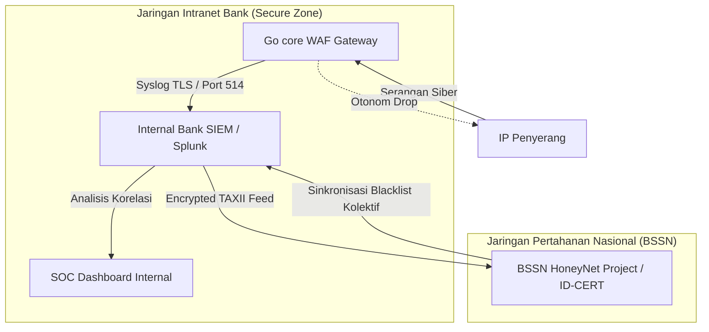

> **Arsip historis** — snapshot; kontrak hidup: [PRODUCT_MODEL.md](./PRODUCT_MODEL.md), [CAPABILITIES.md](./CAPABILITIES.md).

---

# � RENCANA ARSITEKTUR INTELIJEN ANCAMAN SKALA PERBANKAN

## Transisi dari AbuseIPDB Publik ke Jaringan Threat Intelligence Privat Nasional

---

## 1. Latar Belakang & Analisis Skala

Pada lingkungan pengujian (*sandbox/portfolio*), integrasi API eksternal seperti **AbuseIPDB (Free)** sangat memadai untuk melakukan verifikasi fungsionalitas asinkronisasi pelaporan IP penyerang.

Namun, ketika sistem **Nexus Cyber** diterapkan di sektor **Infrastruktur Informasi Kritis (IIK)** seperti perbankan nasional Indonesia, ada dua batasan utama yang wajib dipenuhi:

1. **Skala Volume Serangan (Scalability)**: Serangan botnet terkoordinasi dapat memicu jutaan log blokir per jam. Batasan API gratis (1.000/hari) atau berbayar standar akan langsung terlampaui.
2. **Kedaulatan Data & Regulasi Hukum**: Bank Indonesia (BI) dan Otoritas Jasa Keuangan (OJK) melarang keras pengiriman data siber internal perbankan keluar negeri secara publik tanpa izin.

---

## 2. Kepatuhan Regulasi Perbankan Indonesia

Integrasi API luar negeri publik seperti AbuseIPDB bertentangan dengan standar regulasi siber nasional berikut:

| Regulasi / UU                                                 | Klausul Terkait                              | Dampak Pelanggaran                                                                                                                                                                   |
| :------------------------------------------------------------ | :------------------------------------------- | :----------------------------------------------------------------------------------------------------------------------------------------------------------------------------------- |
| **UU Pelindungan Data Pribadi (UU PDP) No. 27/2022**    | Transfer Data Pribadi Lintas Batas Negara    | Mengirimkan log lalu lintas (yang mungkin memuat IP publik nasabah atau potongan query data transaksi sensitif) ke API server asing secara langsung.                                 |
| **POJK No. 11/SEC/2022 (Penyelenggaraan TI Bank Umum)** | Penempatan Pusat Data & Kedaulatan Informasi | Log keamanan perbankan merupakan data rahasia (*Internal Confidential*) yang wajib disimpan di dalam negeri dan tidak boleh diekspos ke pihak ketiga global tanpa enkripsi khusus. |
| **Standar Keamanan PCI-DSS (Sektor Kartu Kredit)**      | Requirement 10: Logging & Monitoring         | Data log audit harus tersentralisasi di dalam lingkup jaringan tertutup bank (*Cardholder Data Environment / CDE*).                                                                |

---

## 3. Arsitektur Threat Intelligence Privat (Target Produksi)

Untuk menggantikan AbuseIPDB pada skala perbankan, gateway akan diintegrasikan dengan arsitektur **Threat Intelligence Privat** nasional:



### 3.1 Komponen Pengganti

1. **Protokol Syslog TLS (RFC 5424)**:
   Alih-alih memanggil HTTP POST API luar negeri secara asinkron di dalam gateway, modul pelaporan diubah untuk mengirimkan log telemetri menggunakan enkripsi **Syslog over TLS** ke server SIEM internal bank (misal: Splunk, Elastic Search, atau IBM QRadar).
2. **Jaringan TAXII Server (BSSN HoneyNet)**:
   Laporan ancaman siber dikirim ke server pusat **Badan Siber dan Sandi Negara (BSSN)** atau **ID-CERT** menggunakan standar format **STIX/TAXII** (Structured Threat Information Expression) secara terenkripsi.
3. **Local Sync Blacklist (Peta Blokir Kolektif)**:
   Bank secara dinamis mengunduh daftar blacklist IP terverifikasi yang didistribusikan secara kolektif oleh BSSN untuk di-inject ke memori RAM/Redis gateway, sehingga memblokir peretas sebelum mereka sempat menyentuh gerbang proxy bank.

---

## 4. Rencana Langkah Migrasi Kode (Migration Steps)

Langkah penyesuaian kode pada Go Gateway untuk beralih dari AbuseIPDB ke Syslog SIEM Perbankan:

1. **Menghapus Dependencies Eksternal**:
   Menghapus berkas `abuseipdb.go` dari modul `internal/database`.
2. **Implementasi Syslog Logger (Go native `log/syslog`)**:
   Mengganti pemanggilan `ReportAbuseIP` di fungsi `BanIP` dengan metode pengiriman ke daemon syslog internal bank:

   ```go
   // Rencana Kode Pengganti di internal/database/postgres.go
   func sendToBankSIEM(ip string, reason string) {
       sysLog, err := syslog.Dial("tcp", "siem-internal.bank.net:514", syslog.LOG_WARNING|syslog.LOG_AUTH, "NEXUS-WAF")
       if err == nil {
           sysLog.Write([]byte(fmt.Sprintf("ALERT: IP %s blocked. Reason: %s", ip, reason)))
           sysLog.Close()
       }
   }
   ```

3. **Pembersihan Berkas `.env`**:
   Menghapus variabel `ABUSEIPDB_API_KEY` dan menggantinya dengan variabel internal:

   ```env
   BANK_SIEM_ENDPOINT=siem-internal.bank.net:514
   BANK_SIEM_PROTOCOL=tcp-tls
   ```
