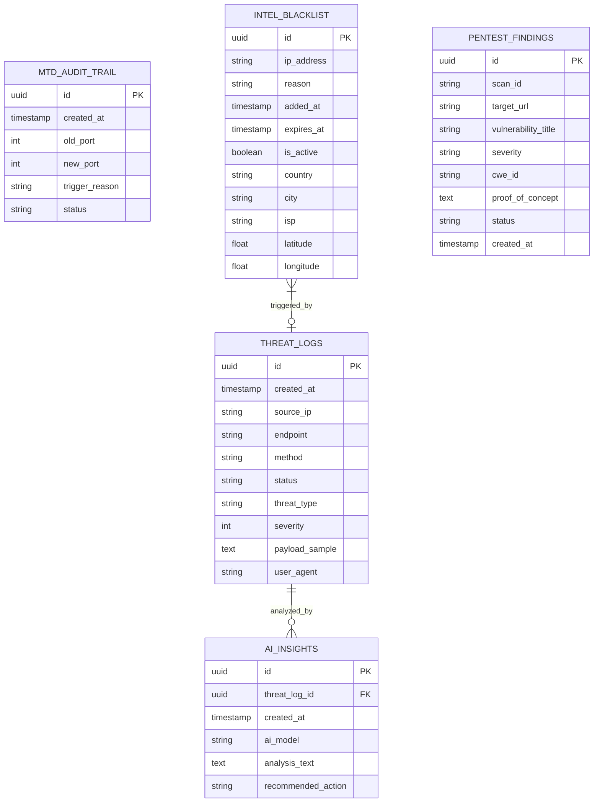
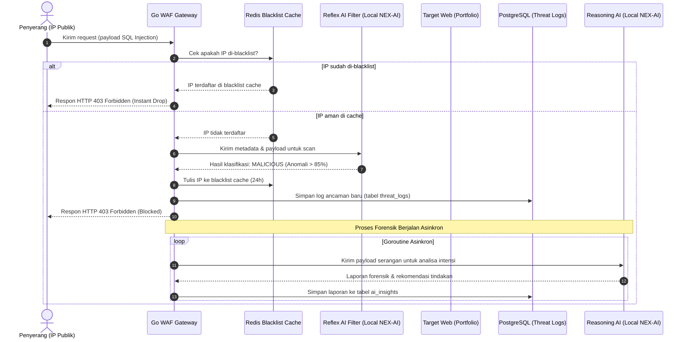
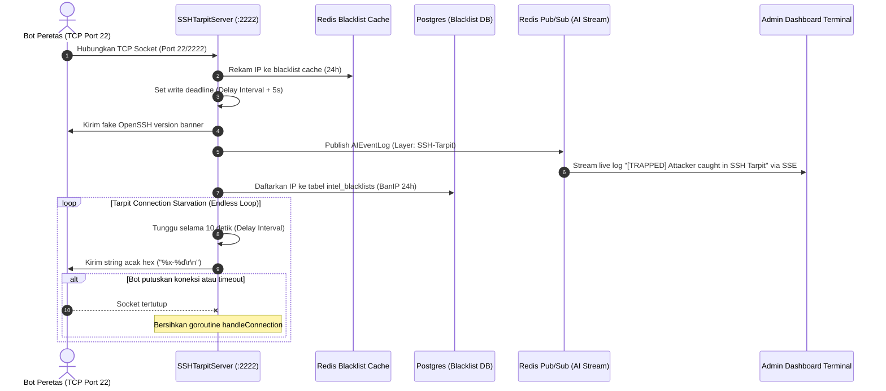
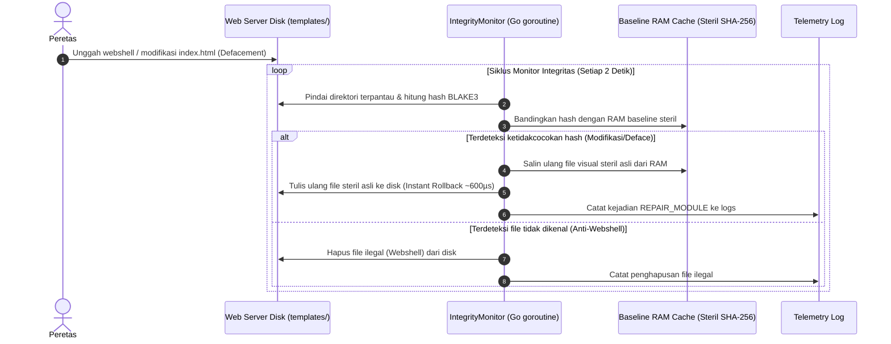

# 📄 SOFTWARE DESIGN DOCUMENT (SWD)
## Nexus Cyber - Autonomous Tactical Defense Grid & Command Center

Pembaruan 2026-08-15: Control plane SOC = listener terpisah `:8081` + cookie operator. Data plane = `:8080`. eBPF di dokumen desain lama = **target**, bukan driver aktif. Provisioner SaaS / Stripe = belum.

---

Sistem Nexus Cyber menggunakan pola desain **Microservices Loosely-Coupled** yang memisahkan antara lapisan *Data Plane* (WAF Gateway di Go) dengan *Control Plane* (SOC Dashboard di Next.js), serta mendukung 2 Topologi Deployment:
- **Mode B2B SaaS (Cloud Multi-Tenant)**: Gateway berjalan di Cloud Proxy Cluster kita. Klien swasta mengarahkan CNAME domain mereka ke proxy kita. Notifikasi Telegram di-route secara dinamis ke HP masing-masing pemilik domain per-tenant.
- **Mode B2G GovEdu (Self-Hosted On-Premise)**: Gateway dipasang 100% di server/Pusat Data (PDN) milik instansi pemerintah/sekolah itu sendiri. Seluruh data & AI lokal berjalan di dalam infrastruktur dinas tanpa keluar internet, notifikasi dikirim ke Telegram Group CSIRT Dinas.

Komponen utama:
1.  **Reverse Proxy & Router Layer**: Menerima request HTTP publik, memeriksa kecocokan domain client premium, memproses payload di WAF middleware, dan meneruskan request ke backend target.
2.  **MTD Port Shuffler**: Goroutine independen yang memantau waktu rotasi port target, menghitung port acak menggunakan CSPRNG, dan menginstruksikan router proxy untuk mengubah alamat target secara dinamis.
3.  **Active Deception Modules**:
    *   **HTTP Honeypot**: Server HTTP independen yang berjalan di port `:9090` untuk mendeteksi penyerang web scanning.
    *   **SSH Tarpit**: Listener TCP independen yang mendeteksi probe SSH di port `:2222`.
4.  **Local GeoIP Reader**: Pembaca database biner `.mmdb` MaxMind untuk pencarian negara secara offline dengan performa super cepat.
5.  **Threat Reporter & Telegram Dispatcher**: Goroutine asinkron untuk pengiriman alert instan ke Telegram (Multi-Tenant per-domain di B2B, Group CSIRT di B2G) serta AbuseIPDB/Syslog SIEM.
6.  **NEX-RED Offensive Validation Engine**: Sub-sistem Red Team otonom berbasis multi-agent (White-box AST flow & Black-box dynamic swarm) dengan REST daemon pada port `:3004`.

---

## 2. Diagram Hubungan Entitas Database (ERD)

Desain relasi database PostgreSQL dirancang secara terstruktur untuk memenuhi kepatuhan audit keamanan ISO 27001:



---

## 3. Desain Urutan Logika (Sequence Diagrams)

### 3.1 Alur Penyaringan WAF (Reflex & Reasoning Layer)
Diagram ini menjelaskan bagaimana request HTTP disaring di gateway secara sinkron di Reflex AI, lalu dianalisis secara asinkron di Reasoning AI:



### 3.2 Alur Jebakan SSH Tarpit & Auto-Banning
Diagram ini mendeskripsikan bagaimana koneksi port scanning SSH dijebak dan dibekukan secara tiada akhir:



### 3.3 Alur Pemulihan Mandiri Otonom (Self-Repair)
Diagram ini menjelaskan siklus periodik monitor integritas visual web yang memulihkan defacement:



### 3.4 Alur Router Notifikasi Telegram Multi-Tenant per Domain (Zero COGS)
Diagram ini menjelaskan alur dispatching pesan ancaman secara dinamis ke akun Telegram masing-masing pemilik domain dengan fitur *debounce cooldown filter*:

```mermaid
sequenceDiagram
    autonumber
    actor Attacker as Penyerang (IP Publik)
    participant Gateway as Go WAF Gateway
    participant Reporter as TelegramBotReporter (Go Goroutine)
    participant DB as PostgreSQL (domain_subscriptions)
    participant Telegram as Official Telegram Bot API (@NexusCyberAlertBot)
    actor Client as HP Klien B2B (Pemilik Domain)

    Attacker->>Gateway: Kirim payload serangan ke domain target (misal: tokosaya.com)
    Gateway->>Gateway: Deteksi ancaman & Ban IP penyerang
    Gateway->>Reporter: Panggil ReportThreatForDomain("tokosaya.com", IP, categories, comment)
    
    go Goroutine Asinkron (Zero Latency Overhead)
        Reporter->>DB: Query GetDomainTelegramConfig("tokosaya.com")
        DB-->>Reporter: Return ChatID ("98765432"), Enabled (True), LastAlertSentAt
        
        alt TelegramEnabled == False
            Note over Reporter: Discard notification (Owner disabled alerts)
        else Debounce Filter Active (< 15 Min)
            Note over Reporter: Discard notification (Prevent DDoS spamming HP)
        else Debounce Filter Passed (> 15 Min)
            Reporter->>DB: Update last_alert_sent_at timestamp
            Reporter->>Reporter: Format Markdown Alert + GeoIP Google Maps Link
            Reporter->>Telegram: HTTP POST /botToken/sendMessage (chat_id="98765432")
            Telegram-->>Client: Push Notification langsung di HP Klien!
        end
    end
```

---

## 4. Desain Struktur Modul Kode (Component Design)

### 4.1 Modul `internal/database`
*   **postgres.go**:
    *   `InitPostgres()`: Menginisialisasi GORM dan menjalankan auto-migrasi skema.
    *   `BanIP(ip, reason, duration)`: Menulis status blacklist ke database, menulis ke local memory map, mendaftarkan ke driver eBPF stub, melakukan pencarian GeoIP, dan memicu `ReportAbuseIP()`.
    *   `getIPGeoInfo(ip)`: Mengecek ketersediaan `GeoLite2-City.mmdb` lokal menggunakan pembaca `geoip2`. Jika sukses, kembalikan data negara & kota secara lokal. Jika gagal, jalankan query HTTP fallback ke `ip-api.com`.
*   **abuseipdb.go**:
    *   `ReportAbuseIP(ip, categories, comment)`: Mengirim request HTTP POST urlencoded ke API AbuseIPDB v2 di dalam goroutine terpisah.

### 4.2 Modul `internal/mtd`
*   **ssh_tarpit.go**:
    *   `NewSSHTarpit(addr, delay)`: Mengembalikan instansi server tarpit SSH.
    *   `Start()`: Meluncurkan TCP listener asinkron.
    *   `handleConnection(conn)`: Menangani socket client, menulis IP ke Redis cache honeypot, memicu callback telemetry & `BanIP()`, dan mengirim data acak periodik.

### 4.3 Modul `nexus-admin-dashboard`
*   **AiTerminalWidget.tsx**:
    *   Instansiasi Xterm.js secara dinamis via dynamic import.
    *   Melacak input buffer (`cmdBuffer`) dan command history (`commandHistory`).
    *   Mendengarkan stream EventSource SSE dari `/api/ai/stream`, mengonversi log ke format kode warna ANSI escape via `formatLogToAnsi()`, membersihkan baris input pengetikan aktif sementara, menulis log baru, dan menggambar ulang baris input prompt.
