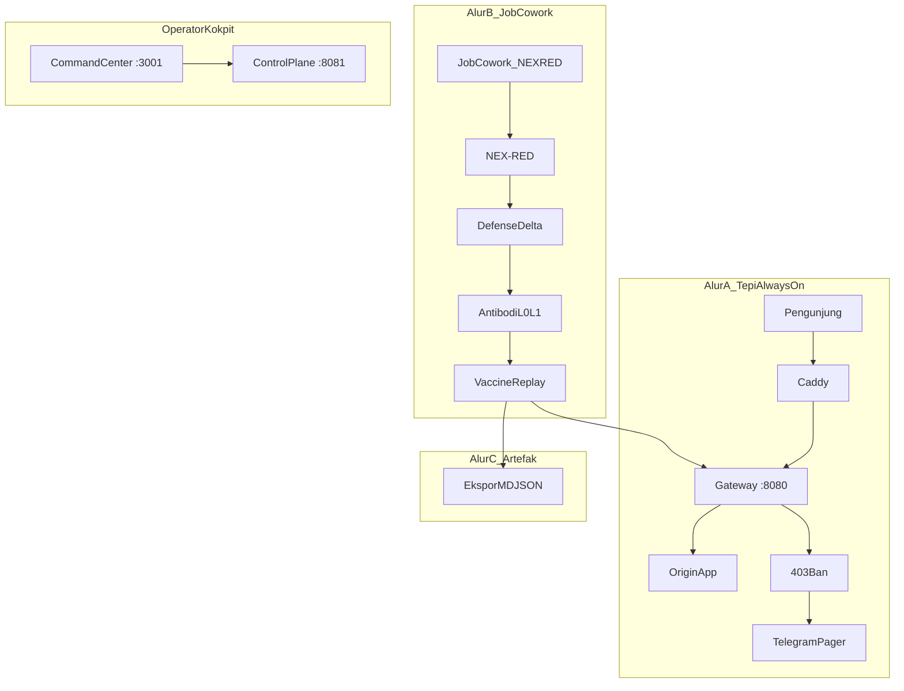

# NEXUS CYBER ARCHITECTURE

**Pembaruan:** 2026-08-22  
**Model produk:** [PRODUCT_MODEL.md](./PRODUCT_MODEL.md) — GaaS Edge Antibody Cowork. Klaim mengikuti kode.

---

## Model produk (GaaS)

Nexus bukan multi-tenant WAF legacy. Arsitektur lab: **satu gateway** + **host map** (portfolio + N tepi) + **Job Cowork** + **Command Center operator** (internal). Bukan CNAME massal.



| Peran | Siapa | Antarmuka |
| --- | --- | --- |
| **Pemilik risiko kanal** | Klien | Artefak Job MD/JSON (export NEX-RED) |
| **Operator Nexus** | Tim internal | `:3001` + `:8081` |
| **Channel Portal** | `:3003` | **Aktif v0.1** — pintu jual B2C/B2B (`nexus-gaas-web/`) |

---

## Port (lab & compose)

| Peran | Alamat | Publik ke hotspot? |
| --- | --- | --- |
| Situs lewat WAF | Caddy `:80` → gateway `:8080` | Ya |
| Control plane SOC | `127.0.0.1:8081` | Tidak |
| Command Center | `127.0.0.1:3001` (compose) | Tidak |
| Honeypot | `:9090` | Ya (umpan) |
| SSH tarpit | `:2222` (root compose saja) | Opsional |
| NEX-RED bridge | `127.0.0.1:3004` | Tidak |
| Juice Shop (NEX-RED lab) | `127.0.0.1:3003` | Tidak — **bentrok** Channel Portal `:3003`; jangan hidupkan bersamaan |
| Postgres / Redis | `127.0.0.1:5432` / `6379` | Tidak |

---

## Tech stack

### Gateway (`nexus-core-gateway`)

- Go `net/http`; Reflex regex; antibodi cache **RAM-first** (Redis share opsional; match Layer 1 → 403); golden GET cache (HTTPS origin); Redis + PostgreSQL (`intel_blacklist` hydrate ke RAM saat start; lab routes: seed upsert + ROUTER-SYNC lalu bind `TARGET_BACKEND` ke `PROTECTED_HOST`/loopback)
- Lab antibody: `/nexred/lab/antibody-signal`, `/nexred/lab/vaccine-probe` (control plane)
- eBPF: **stub**. Satu `PROTECTED_HOST` per instance

### NEX-RED

- Defense delta, antibody loop, agen `recon` / `access` / `injection-hygiene` / `reporter`
- Bridge **3004**; bukan Shannon/Strix

### Dashboard (`nexus-admin-dashboard`)

- Kokpit **operator internal** — bukan produk GaaS yang dijual ke pemilik risiko

### Channel Portal (monorepo)

- `nexus-gaas-web/` — landing, harga, form `/pesan/{sku}`, WA on-prem

---

## Directory structure

```text
D:\NEXUS/
├── nexus-gaas-web/          # Pintu jual Channel Starter
└── nexus-core/
    ├── docs/PRODUCT_MODEL.md
    ├── nexus-core-gateway/
    ├── nexus-admin-dashboard/
    ├── NEX-RED/
    └── deploy-local/
```

---

*Arsitektur GaaS — 2026-08-22.*
